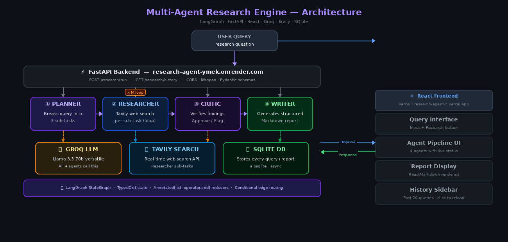

# 🔬 Multi-Agent Research Engine

A production-ready AI research system built with **LangGraph** that orchestrates 4 specialized agents to research any topic, verify sources, and generate structured reports — powered by real web search.

🚀 **Live Demo:** [research-agent-abhishekrathod0111s-projects.vercel.app](https://research-agent-abhishekrathod0111s-projects.vercel.app)

---

## 🎬 Demo

[Demo Video Link](./assets/demo.mp4)

---

## What It Does

You type a research query. Four AI agents collaborate to answer it:

```
Planner → Researcher → Critic → Writer
```

1. **Planner** breaks your query into 3 targeted sub-tasks
2. **Researcher** runs live web searches for each sub-task (via Tavily)
3. **Critic** reviews all findings, flags inconsistencies, approves or requests revision
4. **Writer** generates a structured Markdown report with cited sources

Every query and its report are saved to SQLite — accessible via the history sidebar.

---

## 🏗️ Architecture



### Agent Flow

```
START → planner → researcher ──loop (per sub-task)──→ critic → writer → END
                    ↑__________________________|
```

The researcher runs once per sub-task using LangGraph's **conditional edge routing**. The critic either approves or flags the research before passing to the writer.

---

## 📄 Technical Documentation

Full engineering breakdown, design decisions, and implementation notes:

📎 [Research Agent — Technical Documentation](./assets/research-agent-documentation.docx)

---

## Tech Stack

| Layer | Technology |
|-------|-----------|
| Agent Orchestration | LangGraph (StateGraph, conditional routing) |
| LLM | Groq — Llama 3.3-70b |
| Web Search | Tavily API |
| Backend | FastAPI + Python |
| Frontend | React + Vite |
| Memory | SQLite via aiosqlite |
| Backend Deployment | Render |
| Frontend Deployment | Vercel |

---

## Project Structure

```
research-agent/
├── assets/
│   ├── architecture.png              # System architecture diagram
│   ├── demo.mp4                      # Demo video
│   └── research-agent-documentation.docx
├── frontend/                         # React UI — deployed on Vercel
└── backend/                          # FastAPI — deployed on Render
    └── app/
        ├── graph/
        │   ├── state.py      # Shared TypedDict state (Annotated for safe merging)
        │   ├── nodes.py      # 4 agent functions
        │   ├── graph.py      # StateGraph with conditional routing loop
        │   └── tools.py      # Tavily web search tool
        ├── db/
        │   └── database.py   # SQLite init, save, history queries
        ├── models/
        │   └── schemas.py    # Pydantic request/response models
        ├── routers/
        │   ├── research.py   # POST /research/run
        │   └── history.py    # GET /research/history
        └── main.py           # FastAPI app, CORS, lifespan
```

---

## Local Setup

### Prerequisites
- Python 3.10+
- Node.js 18+
- [Groq API key](https://console.groq.com) (free)
- [Tavily API key](https://tavily.com) (free)

### Backend

```bash
cd backend
python -m venv venv
venv\Scripts\activate        # Windows
# source venv/bin/activate   # Mac/Linux

pip install -r requirements.txt

# Create .env file
echo GROQ_API_KEY=your_key_here > .env
echo TAVILY_API_KEY=your_key_here >> .env

python -m uvicorn app.main:app --reload
```

Backend runs at `http://localhost:8000`  
API docs at `http://localhost:8000/docs`

### Frontend

```bash
cd frontend
npm install
npm run dev
```

Frontend runs at `http://localhost:5173`

---

## API Endpoints

| Method | Endpoint | Description |
|--------|----------|-------------|
| POST | `/research/run` | Run a new research query |
| GET | `/research/history` | Retrieve past 20 queries |

### Example Request

```bash
curl -X POST http://localhost:8000/research/run \
  -H "Content-Type: application/json" \
  -d '{"query": "What are the latest developments in fusion energy?"}'
```

### Example Response

```json
{
  "plan": "1. Current state of fusion research...",
  "final_report": "# Fusion Energy: 2024 Developments\n\n## Executive Summary...",
  "approved": true,
  "critique": "Research is comprehensive and sources are consistent."
}
```

---

## Key Engineering Decisions

**Why LangGraph over a simple LLM call?**  
Each agent has a distinct role. The conditional routing loop lets the researcher run N times (once per sub-task) without hardcoding the number of iterations — the graph decides dynamically based on state.

**Why `Annotated[list, operator.add]` in state?**  
Multiple researcher invocations write to `research_results`. The `operator.add` reducer safely merges each agent's output instead of overwriting it.

**Why SQLite over a hosted DB?**  
Zero-config persistence that works locally and on Render's ephemeral filesystem for demos. Easily swappable for PostgreSQL in production.

---

## Future Improvements

- [ ] Server-Sent Events for real-time agent progress streaming
- [ ] Optional web search toggle per query
- [ ] PostgreSQL for persistent history across deployments
- [ ] Export report as PDF

---

## Author

**Abhishek Rathod**  
[GitHub](https://github.com/Abhishekrathod0111) · Built with LangGraph + FastAPI + React